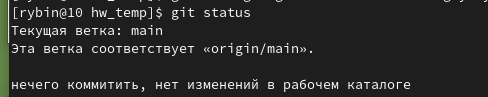
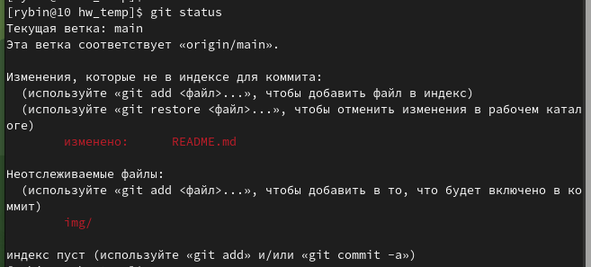
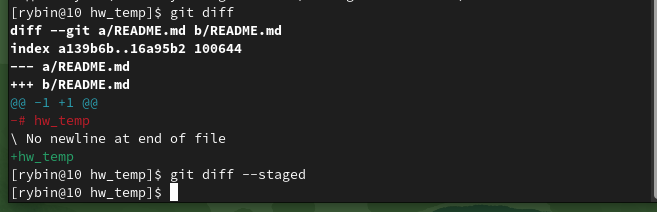
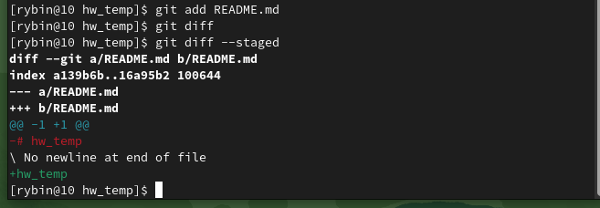
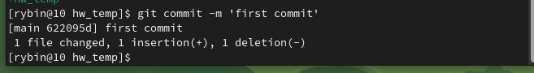
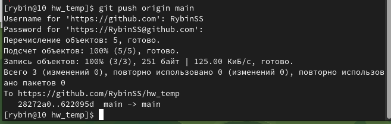

# Домашнее задание к занятию "`Название занятия`" - `Фамилия и имя студента`

### Инструкция по выполнению домашнего задания

   1. Сделайте `fork` данного репозитория к себе в Github и переименуйте его по названию или номеру занятия, например, https://github.com/имя-вашего-репозитория/git-hw или  https://github.com/имя-вашего-репозитория/7-1-ansible-hw).  
   2. Выполните клонирование данного репозитория к себе на ПК с помощью команды `git clone`.  
   <ins>git clone https://github.com/RybinSS/git_hw_8.01</ins>  
   3. Выполните домашнее задание и заполните у себя локально этот файл README.md:
      - впишите вверху название занятия и вашу фамилию и имя
      - в каждом задании добавьте решение в требуемом виде (текст/код/скриншоты/ссылка)
      - для корректного добавления скриншотов воспользуйтесь [инструкцией "Как вставить скриншот в шаблон с решением](https://github.com/netology-code/sys-pattern-homework/blob/main/screen-instruction.md)
      - при оформлении используйте возможности языка разметки md (коротко об этом можно посмотреть в [инструкции  по MarkDown](https://github.com/netology-code/sys-pattern-homework/blob/main/md-instruction.md))
   4. После завершения работы над домашним заданием сделайте коммит (`git commit -m "comment"`) и отправьте его на Github (`git push origin`);
   5. Для проверки домашнего задания преподавателем в личном кабинете прикрепите и отправьте ссылку на решение в виде md-файла в вашем Github.
   6. Любые вопросы по выполнению заданий спрашивайте в чате учебной группы и/или в разделе “Вопросы по заданию” в личном кабинете.
   
Желаем успехов в выполнении домашнего задания!
   
### Дополнительные материалы, которые могут быть полезны для выполнения задания

1. [Руководство по оформлению Markdown файлов](https://gist.github.com/Jekins/2bf2d0638163f1294637#Code)

---

### Задание 1
Что нужно сделать:

1.  Зарегистрируйте аккаунт на GitHub.  

2.  Создайте публичный репозиторий. Обязательно поставьте галочку в поле «Initialize this repository with a README».  

3.  Склонируйте репозиторий, используя https протокол git clone ....  
<ins>git clone https://github.com/RybinSS/hw_temp</ins>  

4.  Перейдите в каталог с клоном репозитория.  
<ins>cd /home/rybin/hw_temp</ins>  

5.  Произведите первоначальную настройку Git, указав своё настоящее имя и email: git config --global user.name и git config --global user.email johndoe@example.com.  
<ins>git config --global user.name RybinSS</ins>  
<ins>git config --global user.email sergeysrybin@gmail.com</ins>  

6.  Выполните команду git status и запомните результат.  
<ins>"нет изменений"</ins>  

  
7.  Отредактируйте файл README.md любым удобным способом, переведя файл в состояние Modified.  
<ins>раскоментируем текст</ins>  

8.  Ещё раз выполните git status и продолжайте проверять вывод этой команды после каждого следующего шага.  
  

9.  Посмотрите изменения в файле README.md, выполнив команды git diff и git diff --staged.  
  

10. Переведите файл в состояние staged или, как говорят, добавьте файл в коммит, командой git add README.md.  
<ins>git add README.md</ins>  

11. Ещё раз выполните команды git diff и git diff --staged.  
  

12. Теперь можно сделать коммит  
<ins>git commit -m 'First commit'.</ins>  
  

13. Сделайте git push origin master.  
  

### Задание 2

1. Создайте файл .gitignore (обратите внимание на точку в начале файла) и проверьте его статус сразу после создания.  
<ins>sudo touch .gitignore</ins>  
2. Добавьте файл .gitignore в следующий коммит git add....  
<ins>git add .gitignore -f</ins>  
<ins>git commit -m 'new gitignore'</ins>  
3. Напишите правила в этом файле, чтобы игнорировать любые файлы .pyc, а также все файлы в директории cache.  
<ins>*.рус</ins>  
<ins>cache/*</ins>  
4. Сделайте коммит и пуш.  
<ins>git commit -m 'gitignore3'</ins>  
<ins>git push origin main</ins>  

  

---

### Задание 3

1. Создайте новую ветку dev и переключитесь на неё.  
<ins>git checkout -b dev</ins>  
2. Создайте файл test.sh с произвольным содержимым.  
<ins>nano test.sh</ins>  
3. Сделайте несколько коммитов и пушей, имитируя активную работу над этим файлом.  
<ins>git add test.sh</ins>  
<ins>git commit -m 'newtest1'</ins>  
<ins>git push origin dev</ins>  
4. Сделайте мердж этой ветки в основную. Сначала нужно переключиться на неё, а потом вызывать git merge.  
<ins>git checkout main</ins>  
<ins>git merge dev</ins>  
5. Сделайте коммит и пуш.  
<ins>git push origin main</ins>

